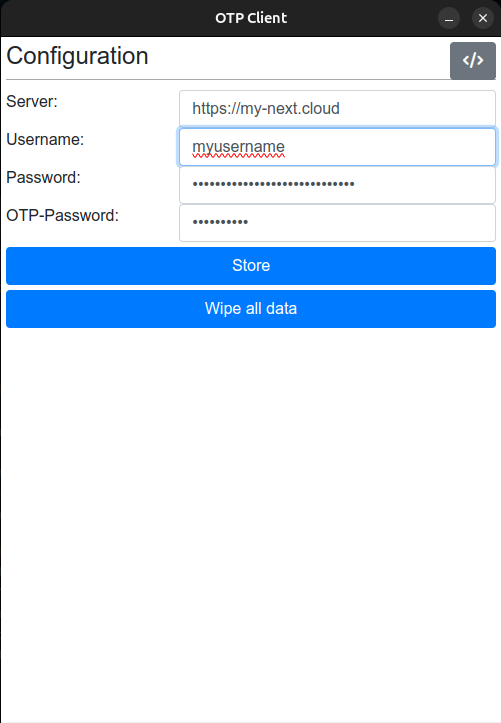

# OTP client

This is a client written in Electron to be used with a Nextcloud instance and the plugin [OTP-Manager](https://apps.nextcloud.com/apps/otpmanager).

It consists of a configuration page, where you can place the login credentails of the Nextcloud instance as well as
the custom password for the OTPManager Plugin, and an account page, that lists all
accounts and calculates the valid OTP.

> The system tray allowing to close and open. The window will always minimize/close to the system tray.

> The configuration

> The accounts page

## Usage

### Installation on Desktop

Currently the client ships with installation packages for APT (deb-package) and Flatpak.
You may use the Client on other operating systems as well (refer to section "Development").
Building executables for Windows and MacOS was prepared, but did not work yet.

### Installation as WebApp

This client can be used as standalone HTML5 Webapp and is fully offline capable too. However,
the Nextcloud plugin "[OTP Manager](https://apps.nextcloud.com/apps/otpmanager)" used by this client
does not allow using the API interface from other sites, as it does not set the Header
[Access-Control-Allow-Origin](https://developer.mozilla.org/de/docs/Web/HTTP/Reference/Headers/Access-Control-Allow-Origin).
Therefore it is not possible to host this WebApp somewhere on the internet and access every NextCloud intance.
The webclient can only connect to the Nextcloud API if it is hosted on the very same domain.

Consequently, you can use this client on every mobile device by just uploading the "src"-folder
as a subdirectory in your Nextcloud instance (it must only use the same domain as your NextCloud instance).
You can then open the client with your mobile device with the URL such as e.g. https://my-next.cloud/otp_client
and bookmark the client to your devices homescreen. It will automatically be used as offline capable app by your device
and behaves exactly if it was an app installed from the AppStore of PlayStore.

### Development

You need to have [npm](https://docs.npmjs.com/) installed on your system. All dependencies can be loaded automatically using the command

`npm install`

Once all dependencies are loaded, start the app using the command

`npm start`

Building a new version as Windows executable or Debian package, use

`npm run make`

Maybe you need to install `flatpak-builder` so that the flatpak-file can be built.
For building the Windows executable on a linux machine, mono and wine must be installed.

## version history

### 1.1.2

- appcache.manifest sends correct headers required by iOS using PHP
- wiping configuration clears accounts list

### 1.1.1

- sort accounts ascending by issuer
- added screenshots to readme

### 1.1.0

- included favicon and splash screens for HTML5 Webapp
- minimize and close to system tray
- option to wipe all data at once
- improved README

### 1.0.9
- bugfix packing bootstrap

### 1.0.8
- fix makers to ignore the dist-folder
- increase auto reloading of all accounts to 10 minutes

### 1.0.7
- transparent background for icon
- close to systray

### 1.0.6
- hide electron window menu

### 1.0.5

- improvements with individual counters based on the accounts period.
- copy current otp code to clipboard
- full offline capability: if there is no internet, uses the last known accounts
- added builders for flatpak, macos, windows, zip, although macos, windows and zip do not yet work.
- ship packages to dist-folder

### 1.0.4

- using electron to build deb package for linux

### 1.0.3

- as standalone HTML5 web app

### 1.0.1 - 1.0.2

- improved ui with bootstrap.

### 1.0.0

- Basic client that allows login with username / password and setting the password of the OTP-Manager.
- Credentials are stored in the localStorage-Object.
- Client is capable of loading existing configurations from Nextcloud and generate the OTP-codes.
